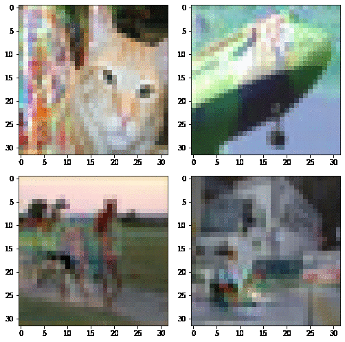

# Viewmaker Networks: Learning Views for Unsupervised Representation Learning

[Alex Tamkin](https://www.alextamkin.com/), [Mike Wu](https://www.mikehwu.com/), and [Noah Goodman](http://cocolab.stanford.edu/ndg.html)

Paper link: [https://arxiv.org/abs/2010.07432](https://arxiv.org/abs/2010.07432)

## 0) Background

Viewmaker networks are a new, more general method for self-supervised learning that enables pretraining with _the same algorithm_ on a diverse range of different modalities—including images, speech, and sensor data.

Viewmaker networks _learn_ a family of data transformations with a generative model, as opposed to prior approaches which use data transformations developed by domain experts through trial and error.

Viewmakers are trained adversarially with respect to the pretraining loss—this means they are compatible with many different pretraining objectives. We present results for SimCLR and InstDisc, but viewmakers are compatible with any view-based objective, including MoCo, BYOL, SimSiam, and SwAV.

Some example distortions learned for images (each frame is generated with a different random noise input to the viewmaker)



## 1) Install Dependencies

We used the following PyTorch libraries for CUDA 10.1; you may have to adapt for your own CUDA version:

```console
pip install torch==1.7.1+cu101 torchvision==0.8.2+cu101 torchaudio==0.7.2 -f https://download.pytorch.org/whl/torch_stable.html
```

Install other dependencies:
```console
pip install -r requirements.txt
```

## 2) Running experiments

Start by running
```console
source init_env.sh
```

Now, you can run experiments for the different modalities as follows:

```console
scripts/run_sensor.py config/sensor/pretrain_viewmaker_pamap2_simclr.json --gpu-device 0
```

This command runs viewmaker pretraining on the [Pamap2](https://archive.ics.uci.edu/ml/datasets/pamap2+physical+activity+monitoring) wearable sensor dataset using GPU #0. (If you have a multi-GPU node, you can specify other GPUs.)

The `scripts` directory holds:
- `run_image.py`: for pretraining and running linear evaluation on CIFAR-10
- `run_meta_transfer.py`: for running linear evaluation on a range of transfer datasets, including many from MetaDataset
- `run_audio.py`: for pretraining on LibriSpeech and running linear evaluation on a range of transfer datasets
- `run_sensor.py`: for pretraining on Pamap2 and running transfer, supervised, and semi-supervised learning on different splits of Pamap2
- `eval_cifar10_c.py`: for evaluating a linear evaluation model on the CIFAR-10-C dataset for assessing robustness to common corruptions

The `config` directory holds configuration files for the different experiments,  specifying the hyperparameters from each experiment. The first field in every config file is `exp_base` which specifies the base directory to save experiment outputs, which you should change for your own setup.

You are responsible for downloading the datasets. Update the paths in `src/datasets/root_paths.py`.

Training curves and other metrics are logged using [wandb.ai](wandb.ai)
